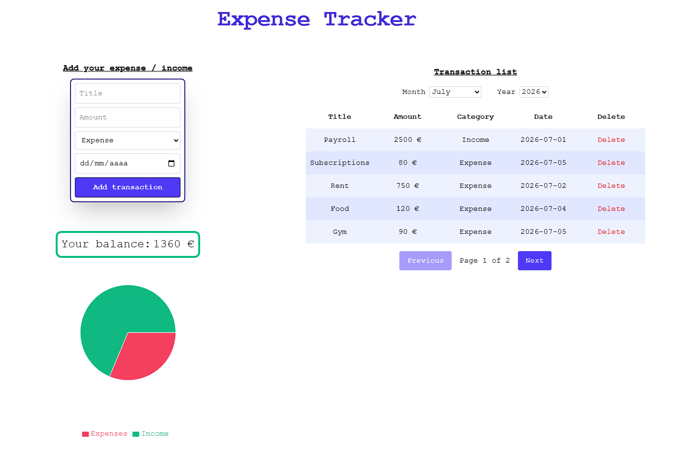

# 💰 Expense Tracker



A modern and responsive **Expense Tracker** built with **React**, **TypeScript**, and **Tailwind CSS**. It allows users to manage their personal finances by tracking income and expenses, viewing their current balance, and visualizing their spending with an interactive pie chart.

## ✨ Features

- ➕ Add new income and expense transactions
- 🗑️ Delete transactions
- 💾 Persistent data using Local Storage
- 📊 Interactive pie chart showing income vs expenses
- 💰 Real-time balance calculation
- 📅 Filter transactions by month and year
- 📄 Paginated transaction list
- 🎨 Responsive UI built with Tailwind CSS

## 🛠️ Tech Stack

- **React**
- **TypeScript**
- **Vite**
- **Tailwind CSS**
- **Recharts**

## 🚀 Getting Started

### Clone the repository

```bash
git clone https://github.com/DanielGodoyGalindo/expense-tracker
cd expense-tracker
```

### Install dependencies

```bash
npm install
```

### Run the development server

```bash
npm run dev
```

The application will be available at:

```
http://localhost:5173
```

## 📂 Project Structure

```
src/
├── components/
│   ├── Balance.tsx
│   ├── BalanceChart.tsx
│   ├── TransactionForm.tsx
│   ├── TransactionItem.tsx
│   └── TransactionList.tsx
│
├── data/
│
├── types/
│   └── transaction.ts
│
├── App.tsx
└── main.tsx
```

## 🎯 Purpose

This project was developed as part of my web development portfolio to practice:

- React component architecture
- State management with hooks
- TypeScript
- Data persistence using Local Storage
- Data visualization
- Responsive design with Tailwind CSS

## 📄 License

This project is open source and available under the MIT License.